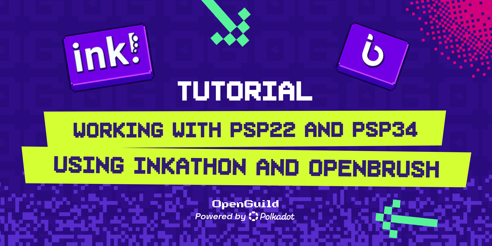

# 📚 Tutorial: Working with PSP22 and PSP34 using Inkathon and OpenBrush

This tutorial will guide you through implementing and working with the PSP22 (a token standard similar to ERC20) and PSP34 (similar to ERC721) using the Inkathon framework and OpenBrush library. These tools are part of the Polkadot ecosystem for smart contract development using the Ink! language.

## Learn more about OpenGuild

- **About us:** [Learn more about us](https://openguild.wtf/about)
- **Website:** [OpenGuild Website](https://openguild.wtf/)
- **Github:** [OpenGuild Labs](https://github.com/openguild-labs)
- **Discord**: [Openguild Discord Channel](https://discord.gg/bcjMzxqtD7)

## 📝 Prerequisites

Before we start, ensure you have the following:

1. **🦀 Rust**: Install Rust and set up your environment.
   - Install Rust: [Rust Installation Guide](https://www.rust-lang.org/tools/install)
   - Add the wasm32-unknown-unknown target: 
     
```bash
     rustup target add wasm32-unknown-unknown
```

2. **💻 Visual Studio Code (VS Code)**: Set up VS Code for Rust and Ink! development.
   - Download and install VS Code from the [official website](https://code.visualstudio.com/).
   - Install the following extensions in VS Code:
     - **Rust Extension**:
       - Go to the Extensions view (`Ctrl+Shift+X`).
       - Search for "Rust" and install the [Rust extension by rust-lang](https://marketplace.visualstudio.com/items?itemName=rust-lang.rust).
     - **Ink! Extension**:
       - In the Extensions view, search for "Ink!" and install the [Ink! extension](https://marketplace.visualstudio.com/items?itemName=ParityTechnologies.ink-vscode).
     - **Rust Analyzer Extension (Recommended)**:
       - This extension provides enhanced Rust language support, including code completion and inline error checking.
       - Search for "Rust Analyzer" in the Extensions view and install the [Rust Analyzer extension](https://marketplace.visualstudio.com/items?itemName=matklad.rust-analyzer).

### 📦 Setup on Different Operating Systems

### 🪟 Windows

1. **Install Rust**:
   - **Option 1: Native Windows Installation**
     - Download and install Rust using the installer provided at the [official Rust website](https://www.rust-lang.org/tools/install).
     - Open Command Prompt (cmd) or PowerShell and run:
       
       ```bash
       rustup target add wasm32-unknown-unknown
       ```

   - **Option 2: Using WSL2 (Recommended)**
     - Install WSL2 if you haven't already by following the [WSL installation guide](https://docs.microsoft.com/en-us/windows/wsl/install).
     - Install a Linux distribution from the Microsoft Store (e.g., Ubuntu).
     - Open your WSL2 terminal (e.g., Ubuntu) and install Rust:
       
       ```bash
       curl --proto '=https' --tlsv1.2 -sSf https://sh.rustup.rs | sh
       ```
     - After installation, add the wasm32 target:
       
       ```bash
       rustup target add wasm32-unknown-unknown
       ```

2. **Install Ink! CLI**:
   - **Option 1: Native Windows Installation**
     - Open Command Prompt or PowerShell and run:
       
       ```bash
       cargo install --force --locked cargo-contract
       ```

   - **Option 2: Using WSL2**
     - In your WSL2 terminal, run:
       
       ```bash
       cargo install --force --locked cargo-contract
       ```

3. **Install Node.js and NPM**:
   - **Option 1: Native Windows Installation**
     - Download the Windows installer from the [Node.js website](https://nodejs.org/) and run it.
     - Confirm installation by running in Command Prompt:
       
       ```bash
       node -v
       npm -v
       ```

   - **Option 2: Using WSL2**
     - In your WSL2 terminal, install Node.js using the package manager:
       
       ```bash
       sudo apt update
       sudo apt install nodejs npm
       ```
     - Confirm installation by running:
       
       ```bash
       node -v
       npm -v
       ```

4. **Install Inkathon and OpenBrush**:
   - **Option 1: Native Windows Installation**
     - In Command Prompt, run:
       
       ```bash
       npm install --save inkathon
       ```
     - For OpenBrush, run:
       
       ```bash
       cargo install cargo-contract
       ```

   - **Option 2: Using WSL2**
     - In your WSL2 terminal, run:
       
       ```bash
       npm install --save inkathon
       ```
     - For OpenBrush, run:
       
       ```bash
       cargo install cargo-contract
       ```

**Note:** Using WSL2 is recommended because it offers a more consistent development environment similar to Linux. This is particularly useful for developers working with tools that are often Linux-first, like Rust and Substrate. WSL2 also supports better file system performance and compatibility with various development tools compared to the native Windows environment.

#### 🍎 macOS

1. **Install Rust**:
   - Use the Terminal and run:
     
     ```bash
     curl --proto '=https' --tlsv1.2 -sSf https://sh.rustup.rs | sh
     ```
   - After installation, add the wasm32 target:
     
     ```bash
     rustup target add wasm32-unknown-unknown
     ```

2. **Install Ink! CLI**:
   - Run in Terminal:
     
     ```bash
     cargo install --force --locked cargo-contract
     ```

3. **Install Node.js and NPM**:
   - Install Node.js via [Homebrew](https://brew.sh/) by running:
     
     ```bash
     brew install node
     ```
   - Confirm installation by running:
     
     ```bash
     node -v
     npm -v
     ```

4. **Install Inkathon and OpenBrush**:
   - In Terminal, run:
     
     ```bash
     npm install --save inkathon
     ```
   - For OpenBrush, run:
     
     ```bash
     cargo install cargo-contract
     ```

#### 🐧 Linux (Ubuntu/Debian)

1. **Install Rust**:
   - Open the terminal and run:
     
     ```bash
     curl --proto '=https' --tlsv1.2 -sSf https://sh.rustup.rs | sh
     ```
   - After installation, add the wasm32 target:
     
     ```bash
     rustup target add wasm32-unknown-unknown
     ```

2. **Install Ink! CLI**:
   - Run in Terminal:
     
     ```bash
     cargo install --force --locked cargo-contract
     ```

3. **Install Node.js and NPM**:
   - Install via package manager:
     
     ```bash
     sudo apt update
     sudo apt install nodejs npm
     ```
   - Confirm installation by running:
     
     ```bash
     node -v
     npm -v
     ```

4. **Install Inkathon and OpenBrush**:
   - In Terminal, run:
     
     ```bash
     npm install --save inkathon
     ```
   - For OpenBrush, run:
     
     ```bash
     cargo install cargo-contract
     ```

## 🚀 Step 1: Set Up a New Ink! Project

Create a new Ink! project for your PSP22 or PSP34 contract.

```bash
cargo contract new my_psp_contract
cd my_psp_contract
```

This will create a basic Ink! project structure.

## 🛠️ Step 2: Add OpenBrush Dependency

Open the `Cargo.toml` file in your project and add OpenBrush as a dependency.

```toml
[dependencies]
ink = { version = "5.0.0", default-features = false }
openbrush = { tag = "4.0.0", git = "https://github.com/Brushfam/openbrush-contracts", default-features = false, features = [
    "psp22",
] }
```

## 🧑‍💻 Step 3: Implement PSP22 or PSP34

Now, let's implement a basic PSP22 token.

### ⚙️ PSP22 Token Implementation:

Create a new file `lib.rs` under the `src` directory and paste the following code:

```rust
use ink_lang as ink;
use openbrush::contracts::psp22::*;
use openbrush::traits::Storage;

#[ink::contract]
mod my_psp22 {
    use super::*;
    use openbrush::contracts::psp22::extensions::mintable::*;

    #[ink(storage)]
    #[derive(Default, Storage)]
    pub struct MyPSP22 {
        #[storage_field]
        psp22: psp22::Data,
    }

    impl PSP22 for MyPSP22 {}
    impl PSP22Mintable for MyPSP22 {}

    impl MyPSP22 {
        #[ink(constructor)]
        pub fn new(initial_supply: Balance) -> Self {
            let mut instance = Self::default();
            instance._mint_to(Self::env().caller(), initial_supply).expect("Should mint");
            instance
        }
    }
}
```

This code creates a basic PSP22 token with minting functionality.

### ⚙️ PSP34 Token Implementation:

For PSP34, create a new file `lib.rs` under the `src` directory and paste the following code:

```rust
use ink_lang as ink;
use openbrush::contracts::psp34::*;
use openbrush::traits::Storage;

#[ink::contract]
mod my_psp34 {
    use super::*;
    use openbrush::contracts::psp34::extensions::enumerable::*;

    #[ink(storage)]
    #[derive(Default, Storage)]
    pub struct MyPSP34 {
        #[storage_field]
        psp34: psp34::Data,
    }

    impl PSP34 for MyPSP34 {}
    impl PSP34Enumerable for MyPSP34 {}

    impl MyPSP34 {
        #[ink(constructor)]
        pub fn new() -> Self {
            Self::default()
        }

        #[ink(message)]
        pub fn mint(&mut self, to: AccountId, id: Id) -> Result<(), PSP34Error> {
            self._mint_to(to, id)
        }
    }
}
```

This code creates a basic PSP34 token with enumerable functionality.

## 🔨 Step 4: Compile and Deploy

Compile your contract using the following command:

```bash
cargo +nightly contract build
```

This will generate a `.wasm` file that you can deploy on a Substrate-based chain.

## 🌐 Step 5: Deploy and Interact using Inkathon

Inkathon provides tools to interact with your smart contract from a TypeScript environment.

### ⚙️ Create a new Inkathon project:

```bash
npm install -g @myestery/create-inkathon-app
npx @myestery/create-inkathon-app my-app
cd my-app 
npm install
```

### 🚀 Deploy the Contract:

Use the Inkathon framework to deploy your contract:

```typescript
import { deployContract } from '@scio-labs/inkathon';

async function deployPSP22Contract() {
    const contractAddress = await deployContract({
        codeHash: '<your_contract_code_hash>',
        constructor: '<constructor>',
        gasLimit: '<gas_limit>',
        value: '<value>',
    });
    console.log('Contract deployed at:', contractAddress);
}

deployPSP22Contract();
```

Replace `<your_contract_code_hash>`, `<constructor>`, `<gas_limit>`, and `<value>` with the appropriate values from your contract.

### 💬 Interact with the Contract:

Use Inkathon's functions to call your contract methods, such as minting tokens, transferring, etc.

```typescript
import { callContractMethod } from '@scio-labs/inkathon';

async function mintPSP22Token(contractAddress: string, to: string, amount: string) {
    const result = await callContractMethod({
        address: contractAddress,
        method: 'mint',
        args: [to, amount],
        gasLimit: '<gas_limit>',
        value: '<value>',
    });
    console.log('Minting result:', result);
}

mintPSP22Token('<contract_address>', '<recipient_address>', '1000');
```

## 🎉 Conclusion

You’ve now set up a basic environment to work with PSP22 and PSP34 contracts using Inkathon and OpenBrush. You can expand these contracts by implementing additional features or extending the functionality according to your needs.

Feel free to explore further by diving into the [Ink! documentation](https://use.ink/) and the [OpenBrush GitHub repository](https://github.com/Brushfam/openbrush-contracts) for more advanced use cases and examples.

---

# 🙌 How to contribute to the community?

To submit a proposal, ideas, or any questions, please submit them here: [OpenGuild Discussion 💬](https://github.com/orgs/openguild-labs/discussions)
View tickets and activities that you can contribute: [Community Activities 🖐️](https://github.com/orgs/openguild-labs/discussions/categories/activities)

- **Help to grow the community:** Community growth is a collective effort. By actively engaging with and inviting fellow enthusiasts to join our community, you play a crucial role in expanding our network. Encourage discussions, share valuable insights, and foster a welcoming environment for newcomers.

- **Participate in workshops and events:** Be an active participant in our workshops and events. These sessions serve as valuable opportunities to learn, collaborate, and stay updated on the latest developments in the Polkadot ecosystem. Through participation, you not only enhance your knowledge but also contribute to the collaborative spirit of OpenGuild. Share your experiences, ask questions, and forge connections with like-minded individuals.

- **Propose project ideas:** Your creativity and innovation are welcomed at OpenGuild. Propose project ideas that align with the goals of our community. Whether it's a new application, a tool, or a solution addressing a specific challenge in the Polkadot ecosystem, your ideas can spark exciting collaborations.

- **Contribute to our developer tools:** Get involved in the ongoing development and improvement of tools that aid developers in their projects. Whether it's through code contributions, bug reports, or feature suggestions, your involvement in enhancing these tools strengthens the foundation for innovation within OpenGuild and the broader Polkadot community.

